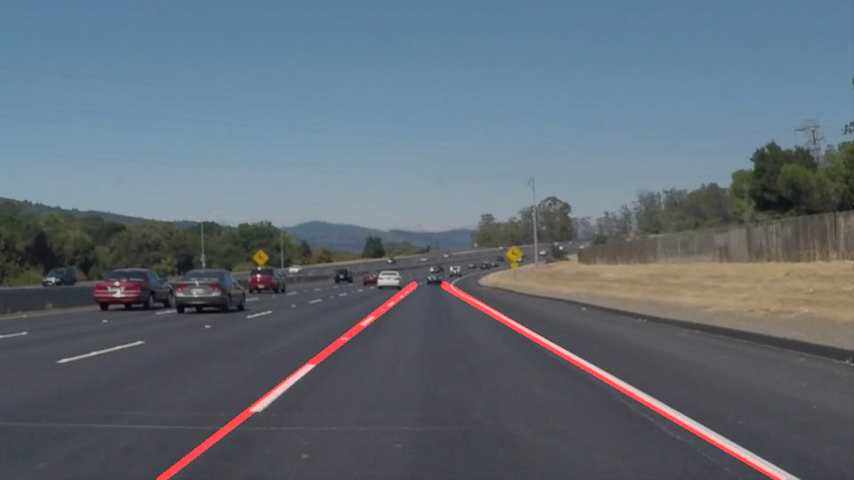
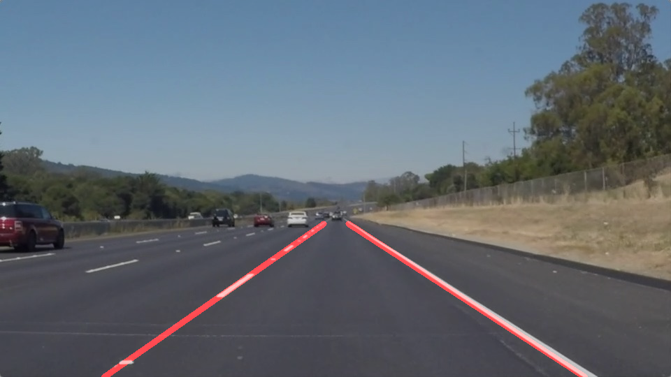
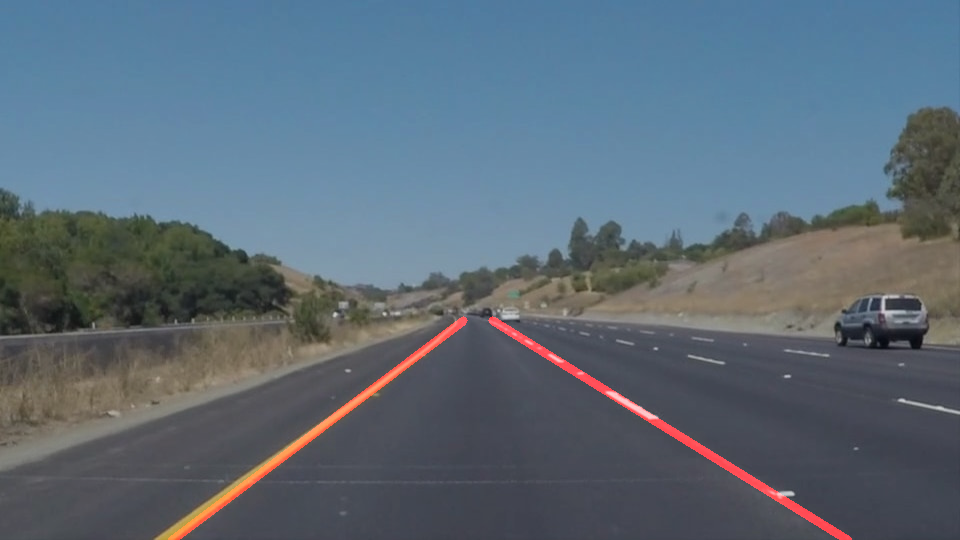
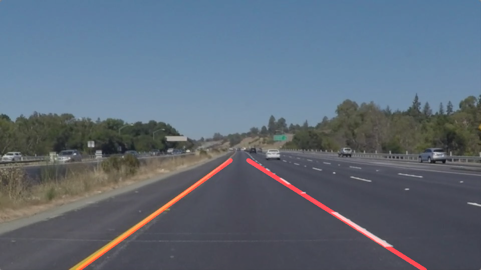
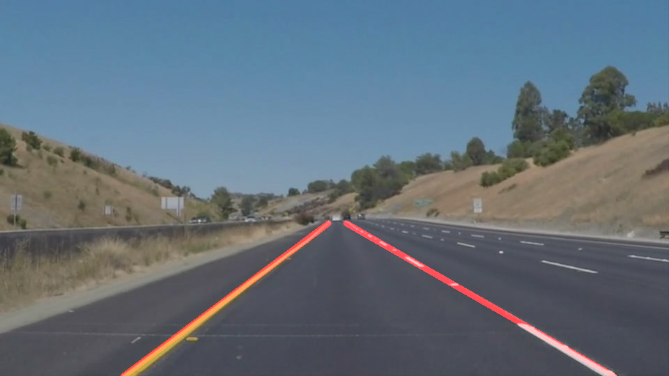
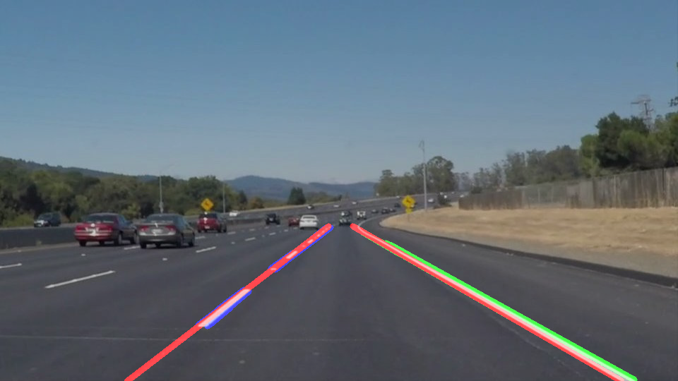

# Finding Lane Lines on the Road

The goals / steps of this project are the following:

* Make a pipeline that finds lane lines on the road
* Reflect on your work in a written report

Pipeline results are shown below:

<table>
    <tr><td>solidWhiteCurve.jpg </td></tr>
    <tr>
        <td></td>
        <td></td>
    </tr>
    <tr><td>solidWhiteRight.jpg </td></tr>
    <tr>
        <td></td>
        <td></td>
    </tr>
    <tr><td>solidYellowCurve.jpg </td></tr>
    <tr>
        <td></td>
        <td></td>
    </tr>
    <tr><td>solidYellowCurve2.jpg </td></tr>
    <tr>
        <td></td>
        <td></td>
    </tr>
    <tr><td>solidYellowLeft.jpg </td></tr>
    <tr>
        <td></td>
        <td></td>
    </tr>
    <tr><td>whiteCarLaneSwitch.jpg </td></tr>
    <tr>
        <td></td>
        <td></td>
    </tr>
</table>

# Reflection

## Image processing pipeline

The pipeline was built in the function `process_pipeline()`. It receives an image and returns this image with the lane lines drawn on it. The following steps were made to achive the result:

1. Convert the received image to grayscale and save it on `gray` variable.

2. Apply gaussian blur to smooth the `gray` image and reduce noise, then save it on `gray_smooth` variable.

3. Apply Canny to the blured grayscale image to find edges with the given lower and upper thresholds and save it on `edges` variable.

4. Define the vertices of the lane lines' region of interest. I choose to use four vertices, two of them are on bottom extremes of the image, and the two remaining are on the end of view of the road height level, both distanced by `horizontal_offset` pixels from the middle of the image, on oposite sides. In that way, we are assuming that the camera is on the center of the car pointing at the same car's driving direction.

5. Get the `masked_edges` image by usign the helper function `region_of_interest()` with the vertices defined in the previous step. 
   
   `region_of_interest()` creates a mask with the given vertices that will be used with function `cv2.bitwise_and()` to create an masked_image that has pixels from input image with only where mask pixels are nonzero.

6. Apply Hough transform on the `masked_edges` image by using the helper function `hough_lines()` and save it on the `lines` variable. 
   
   `hough_lines()` calculates lines on the image by `cv2.HoughLinesP()` with the given parameters, draws the lines found in a blank image of the same size of the `masked_edges` image and return it.

7. Blend the image with lane lines drawn with the original image with the helper function `weighted_img()` and save it on `processed_img` variable.

8. Return `processed_img` image.
   
The helper function `draw_lines()` was modified/improved during this project. To draw a single line on each lane lines, 4 arrays are created to store the upper and bottom extrapolated x values of the left and right lines, then for each line found by `cv2.HoughLinesP()`, the following steps were done:

1. Calculate the slope of the line.
2. Check if slope is greater than 10 degrees from the horizontal (assuming that land lines have inclination greater than 10 degrees, this step helps to avoid noise lines found).
3. Extrapolate this line to the bottom and top of the mask.
4. Check if slope is positive (right lane line) or negative (left lane line) to append the extrapolated line points to the respective array.

After all lines were iterated, for each lane lines side, calculate the median of the upper and lower extrapolated x value array to find the median upper and lower x values, and then draw a single line with these median x values and the corresponding predefined y values (the upper y value is defined as the same used as the upper y value for built the mask image, and the lower y value is bottom y value of the image). 

These lines will represent the land line for the left and right side. The image bellow shows the lines previously found of the left side (blue) and the right side (green), drawn with the double of the red line thickness value. 

## Potential shortcomings with the current pipeline

One potential shortcoming would be what would happen when the lane starts a curve, the lane lines gets out the mask because the mask vertices are predefined. This implementation didn't handle well on curves because it computes a single line from a median of all lines founded on each side. 

Another shortcoming could be if a car gets close. The front car will probably let hough transform find unwanted lines that will interfere in the land line estimation.

## Possible improvements suggestions to the pipeline

A possible improvement would be to calculate horizontal histograms to determine if the line belongs to the left or right side because on a curve it's not possible to guarantee which the lane side it belongs only by the slope value.

Another potential improvement could be to use the least square method to fit a line on the line points founded by hough transform.
